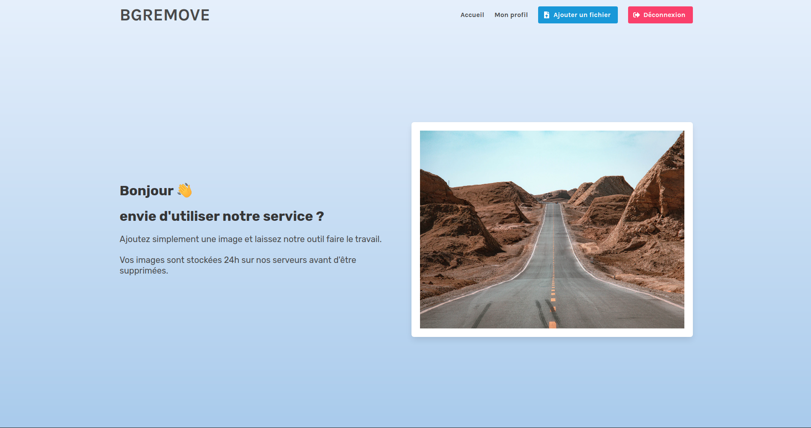

# Chef d'oeuvre


```python
python create_db.py
```

```bash
flask run
```


### fait:

* créer un compte et se connecter
* ajouter des images sur son compte et les supprimer


### à faire:

* partie ML
* analyse avec chart.js
* dashboard admin
* logger Flask entre différents Blueprints
* monitoring logs (sur le dashboard admin?)
* login avec username ou mail (optionnel)


Aperçu front



